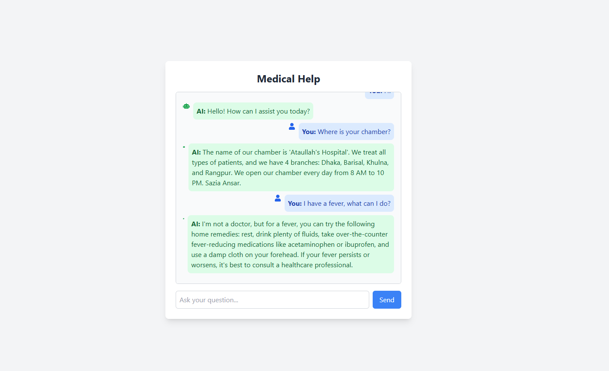

# Medical Help Chat Application



## Overview

The Medical Help Chat Application is an AI-powered chat system designed to assist users with medical inquiries. It provides predefined responses for common questions and can also engage in natural conversations using OpenAI's language model.

## Features

- **AI-Powered Responses**: Utilizes OpenAI's API to provide intelligent responses to user queries.
- **Default Questions**: Offers a set of predefined questions for users to quickly get information about the medical chamber.
- **User-Friendly Interface**: Modern and responsive design with a floating question feature.
- **Scroll Functionality**: Automatically scrolls to the latest message and provides a button to return to the latest message if the user scrolls up.

## Technologies Used

- **Next.js**: A React framework for building server-rendered applications.
- **Tailwind CSS**: A utility-first CSS framework for styling.
- **OpenAI API**: For generating AI responses.

## Getting Started

### Prerequisites

Make sure you have [Node.js](https://nodejs.org/) installed on your machine.

### Installation

1. Clone the repository:

   ```bash
   git clone https://github.com/ataullah1/Health-Chat-Bot-with-OpenAI.git
   cd medical-help-chat
   ```

2. Install dependencies:

   ```bash
   npm install
   ```

3. Set up environment variables:

   - Create a `.env.local` file in the root directory and add your OpenAI API key:
     ```
     OPENAI_API_KEY=your_openai_api_key
     ```

4. Run the application:

   ```bash
   npm run dev
   ```

5. Open [http://localhost:3000](http://localhost:3000) in your browser to see the application in action.

## Usage

- Start a conversation by typing your question in the input box.
- You can also click on the predefined questions to get quick responses.
- The chat will display responses from the AI and allow for continuous interaction.

## Learn More

To learn more about Next.js, take a look at the following resources:

- [Next.js Documentation](https://nextjs.org/docs) - learn about Next.js features and API.
- [Learn Next.js](https://nextjs.org/learn) - an interactive Next.js tutorial.

## Deploy on Vercel

The easiest way to deploy your Next.js app is to use the [Vercel Platform](https://vercel.com/new?utm_medium=default-template&filter=next.js&utm_source=create-next-app&utm_campaign=create-next-app-readme) from the creators of Next.js.

Check out our [Next.js deployment documentation](https://nextjs.org/docs/app/building-your-application/deploying) for more details.

## Contributing

Contributions are welcome! Please feel free to submit a pull request or open an issue for any suggestions or improvements.

## License

This project is licensed under the MIT License.
